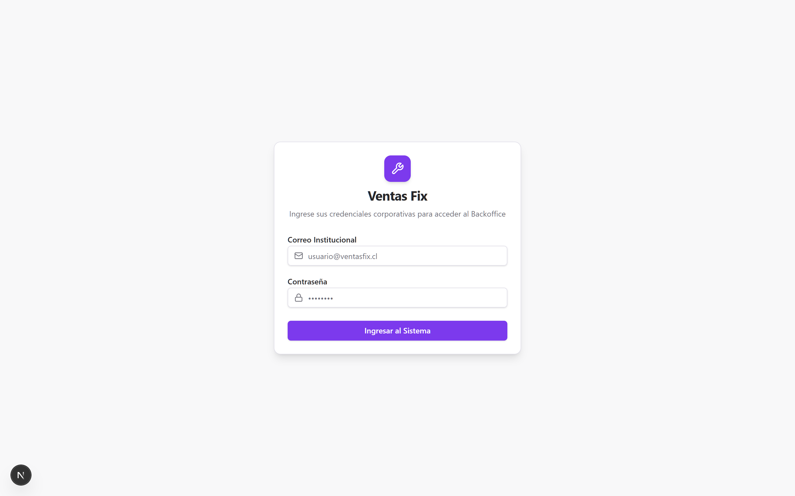
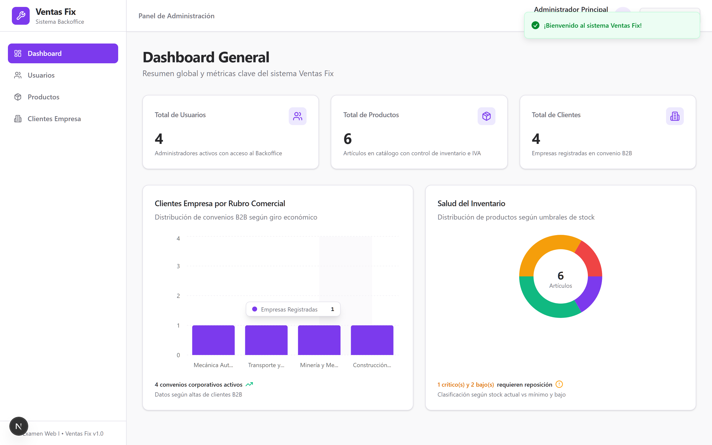
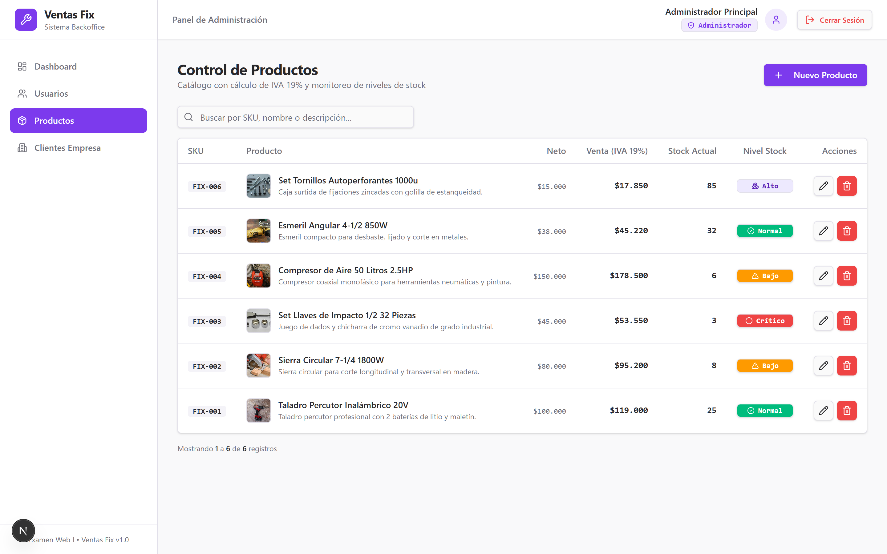
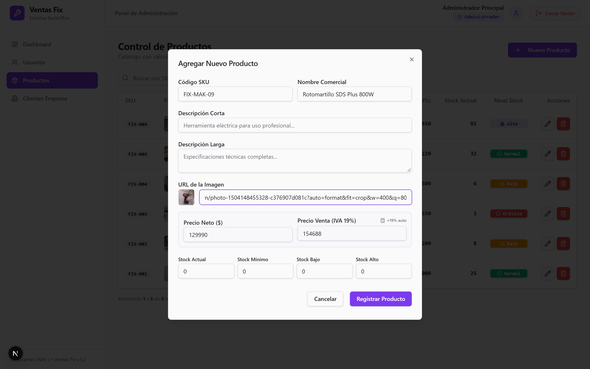
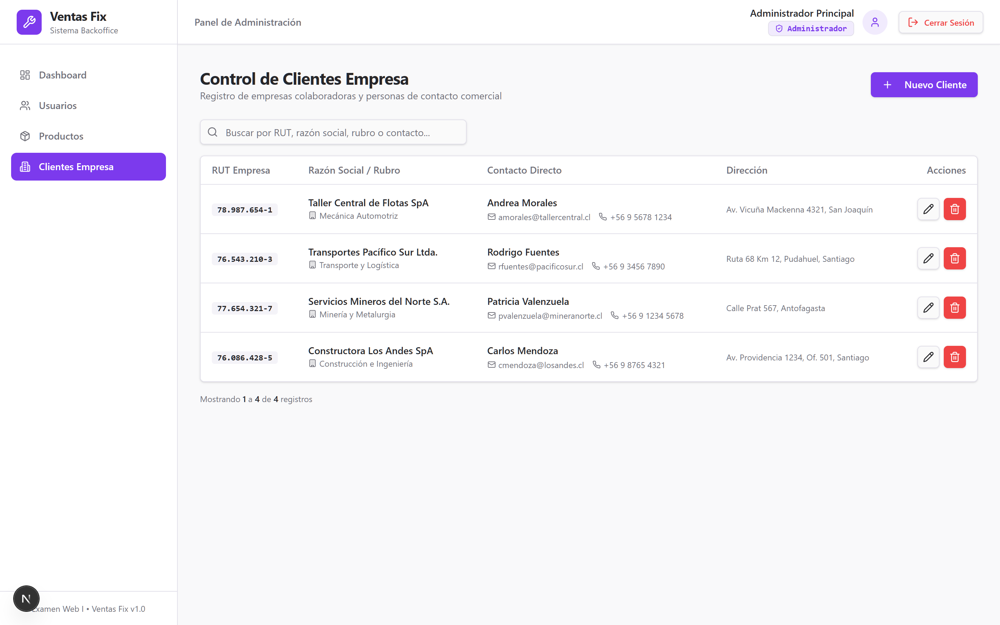
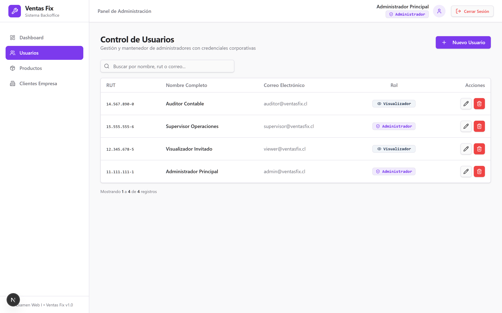

# Ventas Fix — Frontend Backoffice Web & Gestión Comercial

Aplicación web frontend (Backoffice administrativo) desarrollada para la empresa **Ventas Fix**, orientada a la administración interna de usuarios, control de catálogo de artículos con cálculo de impuestos y gestión de clientes corporativos (B2B). Desarrollada con fines académicos para el **Instituto Profesional IPSS** como entrega del **Examen Transversal** de la asignatura **Desarrollo de Software Web I — Sección 51**.

| | |
| :--- | :--- |
| **Desarrolladora** | Gina Norambuena Sánchez |
| **Docente** | Boris Belmar |
| **Asignatura** | Desarrollo de Software Web I — Sección 51 |
| **Institución** | Instituto Profesional IPSS |
| **Evaluación** | Examen Transversal (Microservicio y Backoffice) |

Este repositorio contiene la **Aplicación Web Backoffice**. El backend REST API (NestJS 11) se encuentra en el repositorio hermano `ventasfix-back-IPSS`.

---

## Tabla de contenidos

- [Características](#características)
- [Tecnologías](#tecnologías)
- [Requisitos](#requisitos)
- [Puesta en marcha](#puesta-en-marcha)
- [Variables de entorno](#variables-de-entorno)
- [Arquitectura de Frontend](#arquitectura-de-frontend)
- [Patrones de Diseño Implementados](#patrones-de-diseño-implementados)
- [Control de Acceso Basado en Roles (RBAC)](#control-de-acceso-basado-en-roles-rbac)
- [Estrategia UX/UI Desktop & Tablet-First](#estrategia-uxui-desktop--tablet-first)
- [Módulos y Vistas del Sistema](#módulos-y-vistas-del-sistema)
- [Cuentas de Acceso Preconfiguradas](#cuentas-de-acceso-preconfiguradas)
- [Batería de Pruebas End-to-End (Playwright)](#batería-de-pruebas-end-to-end-playwright)
- [Nota sobre el proceso de desarrollo](#nota-sobre-el-proceso-de-desarrollo)

---

## Características

- **Next.js 15 (App Router) + React 19 + TypeScript:** Base de código moderna, tipado estricto en tiempo de compilación y renderizado híbrido optimizado.
- **Tailwind CSS v4 + Shadcn UI:** Sistema de diseño minimalista con paleta de colores violeta corporativa, componentes de accesibilidad Radix UI y tokens CSS.
- **Capa de Abstracción CRUD Adapter:** Encapsulación de Axios bajo el patrón Adapter (`crud-adapter.ts`), evitando acoplar las vistas a librerías HTTP concretas.
- **Gestión de Estado Reactivo con Zustand 5:** Stores modulares e independientes (`auth`, `users`, `products`, `clients`, `dashboard`) con persistencia local de sesión.
- **Seguridad y Permisos RBAC (`usePermissions`):**
  - Perfil **`ADMIN`**: Acceso total para consultar, registrar, editar y eliminar registros en todos los módulos.
  - Perfil **`VIEWER`**: Modo de auditoría y solo lectura. Botones de acción (`Pencil` y `Trash2`) deshabilitados de forma accesible (`disabled`) y botones de creación ocultos.
- **Dashboard Ejecutivo con Gráficos Dinámicos (Recharts + Shadcn UI):**
  - **Clientes Empresa por Rubro Comercial:** Gráfico de barras 100% reactivo conectado a la base de datos que clasifica clientes según su giro económico.
  - **Salud del Inventario (Donut Chart):** Gráfico de dona con cálculo en tiempo real de productos según umbrales de stock (`Crítico`, `Bajo`, `Normal`, `Alto`) y alertas de bodega.
- **Catálogo de Productos Avanzado:**
  - Miniaturas de fotos (`40x40px`) integradas en la tabla con fallback automático de icono `Package`.
  - Previsualización de imagen en vivo en el modal de creación y edición.
  - Sincronización automática de **IVA (19%)** (`precioVenta = Math.round(precioNeto * 1.19)`).
  - Badges semánticos para monitoreo de stock.
- **Mantenedor de Clientes Empresa B2B:** Registro y edición con validación de identidad corporativa y RUT Chileno (Módulo 11).
- **Mantenedor de Usuarios:** Asignación de roles institucionales con reglas estrictas de dominio `@ventasfix.cl`.
- **Tabla Reutilizable `<DataTable>`:**
  - Soporte para alineación semántica (`left`, `center`, `right`).
  - Búsqueda y filtrado instantáneo en memoria.
  - Paginación client-side de **6 registros por página** con controles accesibles de navegación para evitar desbordes visuales.
- **Sistema Unificado de Badges `<AppBadge>`:** Ancho fijo constante (`92px` para inventario y `124px` para roles) para garantizar estabilidad visual en las tablas.
- **Notificaciones Enriquecidas con Sonner:** Toasts contextuales de éxito y error en todas las operaciones del sistema.

---

## Tecnologías

| Tecnología | Propósito |
| :--- | :--- |
| **Next.js 15.5** | Framework web moderno con App Router y arquitectura por rutas |
| **React 19** | Biblioteca declarativa de interfaces de usuario |
| **TypeScript 5** | Tipado estático estricto y prevención de errores en desarrollo |
| **Tailwind CSS v4** | Motor de estilos basado en clases utilitarias y tokens HSL |
| **Shadcn UI** | Colección de componentes accesibles basados en Radix UI |
| **Zustand 5** | Gestión de estado global ligera y reactiva (Observer Pattern) |
| **Axios** | Cliente HTTP encapsulado mediante el patrón Adapter |
| **Zod** | Validación declarativa de esquemas de formularios en cliente |
| **Recharts 3 + Shadcn Charts** | Visualización de datos con gráficos SVG interactivos |
| **Sonner** | Sistema de alertas y notificaciones toast |
| **Lucide React** | Biblioteca iconográfica minimalista |

---

## Requisitos

- **Node.js 20+** o **Node.js 22+**
- Backend en ejecución (`ventasfix-back-IPSS` en `http://localhost:3000`)

---

## Puesta en marcha

### 1. Instalar dependencias

```bash
npm install
```

### 2. Configurar variables de entorno

Crear el archivo `.env.local` en la raíz del frontend (puedes tomar como referencia `.env.example`):

```env
NEXT_PUBLIC_API_URL="http://localhost:3000/api"
```

### 3. Iniciar servidor de desarrollo

```bash
npm run dev
```

La aplicación quedará disponible en: **`http://localhost:3001`**  
*(Acceso directo al login: `http://localhost:3001/login`)*

### 4. Compilación para producción (Opcional)

```bash
# Compilar proyecto optimizado
npm run build

# Iniciar servidor de producción
npm start
```

---

## Comandos útiles

| Comando | Descripción |
| :--- | :--- |
| `npm run dev` | Inicia el servidor de desarrollo en puerto 3001 (`-p 3001`) |
| `npm run build` | Compila y optimiza la aplicación para producción |
| `npm start` | Inicia el servidor Next.js en modo producción en puerto 3001 |
| `npm run lint` | Ejecuta el linter ESLint con reglas estrictas de TypeScript |
| `npm run test:e2e` | Ejecuta la batería de 21 pruebas End-to-End automatizadas con Playwright |
| `npm run screenshots` | Captura automáticamente las fotos HD de todas las vistas del sistema |

---

## Variables de entorno

| Variable | Tipo | Descripción |
| :--- | :---: | :--- |
| `NEXT_PUBLIC_API_URL` | String | URL base del microservicio backend (por defecto: `http://localhost:3000/api`) |

---

## Arquitectura de Frontend

La estructura del código responde a una arquitectura desacoplada y orientada a módulos:

```
src/
├── app/                          # App Router de Next.js 15
│   ├── (dashboard)/              #   Grupo de rutas protegidas por sesión
│   │   ├── dashboard/page.tsx    #     Vista principal con métricas y gráficos
│   │   ├── productos/page.tsx    #     Mantenedor de catálogo de productos
│   │   ├── clientes/page.tsx     #     Mantenedor de empresas clientes B2B
│   │   ├── usuarios/page.tsx     #     Mantenedor de administradores y roles
│   │   └── layout.tsx            #     Layout con Sidebar, Navbar y verificación de auth
│   ├── login/page.tsx            #   Formulario de autenticación con Zod
│   ├── layout.tsx                #   Layout raíz con fuentes y Toaster
│   ├── page.tsx                  #   Redirección automática hacia /login o /dashboard
│   └── globals.css               #   Configuración Tailwind v4 y variables CSS de gráficos
├── components/                   # Componentes de interfaz de usuario
│   ├── layout/                   #   Sidebar, Navbar con avatar y rol
│   ├── modules/                  #   Componentes específicos por dominio de negocio
│   │   ├── dashboard/            #     ClientsPerformanceChart e InventoryStatusChart
│   │   ├── products/             #     ProductFormDialog con preview de imagen
│   │   ├── clients/              #     ClientFormDialog
│   │   └── users/                #     UserFormDialog con selector condicional de rol
│   ├── shared/                   #   Componentes transversales de la aplicación
│   │   ├── data-table.tsx        #     Tabla genérica con búsqueda, alineación y paginación
│   │   ├── app-badge.tsx         #     Registro centralizado de badges (ancho fijo)
│   │   ├── stat-card.tsx         #     Tarjeta de métricas para el Dashboard
│   │   └── confirm-dialog.tsx    #     Modal accesible de confirmación de eliminación
│   └── ui/                       #   Primitivos atómicos de Shadcn UI
│       ├── button.tsx, card.tsx, dialog.tsx, input.tsx, label.tsx, table.tsx, chart.tsx...
├── hooks/                        # Custom React Hooks
│   └── use-permissions.ts        #   Control reactivo de roles (isAdmin, isViewer, canWrite)
├── stores/                       # Estado global con Zustand 5
│   ├── auth.store.ts             #   Gestión de sesión, token JWT y usuario autenticado
│   ├── users.store.ts            #   Estado CRUD de usuarios
│   ├── products.store.ts         #   Estado CRUD de productos e inventario
│   ├── clients.store.ts          #   Estado CRUD de clientes empresa
│   └── dashboard.store.ts        #   Estado de métricas consolidadas
├── api/                          # Servicios de consumo HTTP por módulo
│   ├── auth.api.ts, users.api.ts, products.api.ts, clients.api.ts, dashboard.api.ts
├── lib/                          # Utilidades y adaptadores
│   ├── axios/                    #   Instancia Axios con interceptor de Bearer Token
│   │   ├── axios-client.ts
│   │   └── crud-adapter.ts       #   Patrón Adapter para operaciones CRUD genéricas
│   └── utils.ts                  #   Helper cn() para combinar clases Tailwind
├── interfaces/                   # Contratos fuertemente tipados (IProduct, IUser, etc.)
└── enums/                        # Enumeraciones de negocio (EStockStatus)
```

---

## Patrones de Diseño Implementados

1. **Adapter Pattern (`CrudAdapter`):** Encapsula todas las peticiones HTTP (`getAll`, `getById`, `create`, `update`, `delete`) desacoplando los componentes visuales de la librería cliente concreta.
2. **Observer / Flux Pattern (`Zustand Stores`):** Gestión de estado reactiva, unidireccional y sin boilerplate excesivo, permitiendo que cualquier mutación actualice los gráficos y tablas en tiempo real.
3. **Registry Pattern (`AppBadge`):** Mapeo centralizado de estados de stock y roles a variantes visuales, íconos y anchos constantes, eliminando sentencias `switch` dispersas en el código.
4. **Proxy & Interceptor Pattern:** Axios intercepta cada petición saliente para adjuntar el encabezado `Authorization: Bearer <token>` y captura respuestas erróneas (`401`, `403`, `500`) emitiendo notificaciones automáticas con Sonner.

---

## Control de Acceso Basado en Roles (RBAC)

La interfaz se adapta dinámicamente según el rol almacenado en el token JWT:

```tsx
const { role, isAdmin, isViewer, canWrite } = usePermissions();
```

- **Administrador (`ADMIN`):** Visualiza los botones `Nuevo Producto`, `Nuevo Cliente` y `Nuevo Usuario`. Los botones de edición (`Pencil`) y eliminación (`Trash2`) están activos y funcionales.
- **Visualizador (`VIEWER`):** Los botones de creación se ocultan automáticamente. En las tablas, los botones de edición y eliminación se renderizan con el atributo `disabled`, impidiendo la interacción y garantizando una experiencia de auditoría limpia y accesible.

---

## Estrategia UX/UI Desktop & Tablet-First

A diferencia de un sitio web B2C de consumo masivo, esta aplicación responde a una estrategia deliberada **Desktop & Tablet-First**:
* **Contexto de uso corporativo:** Diseñada para estaciones de trabajo administrativas (computadores de oficina y laptops) y dispositivos portátiles de supervisión en bodega (tablets táctiles de 10"+).
* **Densidad de datos:** Las tablas presentan entre 6 y 8 columnas de métricas críticas (SKU, precios con cálculo de IVA, estado dinámico de stock, fotos y acciones). Forzar esta densidad en smartphones deterioraría la visibilidad operativa.
* **Ergonomía:** El dashboard adapta sus rejillas de 3 a 2 columnas en tablets (`sm:grid-cols-2 lg:grid-cols-3`), y las tablas cuentan con contenedor con desplazamiento horizontal suave (`overflow-x-auto`) y paginación de 6 filas.

---

## Módulos y Vistas del Sistema

### 1. Inicio de Sesión (`/login`)
Formulario de acceso institucional con validación en tiempo real mediante Zod, verificación de dominio `@ventasfix.cl` y retroalimentación visual mediante Sonner toasts.



### 2. Dashboard General (`/dashboard`)
Panel de control con contadores en tiempo real (Usuarios, Productos, Clientes) y dos visualizaciones gráficas interactivas desarrolladas con **Recharts + Shadcn UI**:
- **Barras de Clientes por Rubro:** Distribución según actividad comercial de las empresas registradas.
- **Dona de Salud de Inventario:** Diagnóstico de artículos críticos, bajos, normales y altos con recuento exacto de reposición.



### 3. Control de Productos (`/productos`)
Catálogo con miniaturas de fotos (`40x40px`), autocalculo de IVA (19%), badges semánticos de stock y paginación integrada de 6 registros por página.



#### Modal de Creación y Edición de Producto
Incorpora previsualización de imagen en vivo al ingresar la URL y sincronización reactiva del precio de venta con impuesto:



### 4. Control de Clientes (`/clientes`)
Mantenedor de clientes corporativos (B2B) con validación matemática de RUT Chileno (Módulo 11), giro comercial, datos de contacto y confirmación modal de eliminación.



### 5. Control de Usuarios (`/usuarios`)
Gestión y auditoría de administradores y visualizadores del sistema con asignación estricta de roles institucionales (`ADMIN` y `VIEWER`).



---

## Cuentas de Acceso Preconfiguradas

Para probar ambos niveles de acceso y comprobar el funcionamiento del RBAC:

| Rol | Correo Electrónico | Contraseña | Permisos |
| :--- | :--- | :---: | :--- |
| **ADMIN** | `admin@ventasfix.cl` | `Admin1234!` | Control Total (Crear, Editar, Eliminar) |
| **VIEWER** | `viewer@ventasfix.cl` | `Viewer1234!` | Solo Lectura (Botones deshabilitados) |

## Batería de Pruebas End-to-End (Playwright)

El sistema incorpora una suite integral de **21 pruebas automatizadas E2E** ejecutadas sobre un navegador real (Microsoft Edge headless) que validan los flujos críticos del examen:

```bash
npm run test:e2e
```

### Cobertura de las Pruebas:
1. **Perímetro de Seguridad:** Redirección forzada a `/login` al intentar acceder a rutas protegidas sin token JWT, y rechazo semántico de credenciales incorrectas.
2. **Dashboard & Recharts:** Carga reactiva de contadores KPI y renderizado de gráficos SVG de clientes por rubro y dona de inventario con diagnósticos dinámicos de reposición.
3. **Catálogo & Regla de Negocio de IVA (19%):** Sincronización matemática automática en tiempo real de `precioVenta = Math.round(precioNeto * 1.19)`, previsualización en vivo de URLs de imágenes y filtrado reactivo de tabla con paginación de 6 elementos.
4. **Ciclo CRUD Completo (Create, Update & Clean-up):** Flujo completo de mutación en base de datos real: creación de un producto con SKU temporal, edición interactiva de sus atributos (con recálculo reactivo de IVA) y posterior eliminación mediante el modal de confirmación (`ConfirmDialog`), garantizando la idempotencia del test y dejando la base de datos completamente limpia y en su estado inicial.
5. **Clientes B2B & Algoritmo Módulo 11:** Validación negativa con bloqueo de formulario ante RUTs matemáticamente erróneos (`12.345.678-9`) y validación positiva con formateo automático (`76.086.428-5`).
6. **Usuarios & Dominio Institucional:** Restricción estricta de registro exclusivamente a correos bajo el dominio `@ventasfix.cl`.
7. **Control de Acceso RBAC (Perfil VIEWER):** Comprobación del principio de menor privilegio: ocultamiento total de botones de creación (`Nuevo Producto`, `Nuevo Cliente`, `Nuevo Usuario`) y deshabilitación accesible (`disabled`) de los botones de edición y eliminación en las tablas de datos.

---

## Nota sobre el proceso de desarrollo

Este proyecto fue desarrollado con el apoyo de herramientas avanzadas de inteligencia artificial (el agente de programación `Antigravity` / asistente técnico `Gem` de Google DeepMind) para optimizar tareas de maquetación, refactorización de componentes, tipado estricto en TypeScript y elaboración de documentación.

El uso de estas herramientas se fundamenta en un modelo de **pair programming colaborativo**, donde la **arquitectura general de la aplicación web, el diseño de la experiencia de usuario (UX/UI), la selección del stack tecnológico, la estructuración del estado global y la dirección del proyecto fueron definidas, evaluadas y supervisadas en todo momento por la desarrolladora Gina Norambuena Sánchez**, quien actuó como **arquitecta principal de frontend**, aprobando cada decisión técnica antes de su incorporación al código final.
